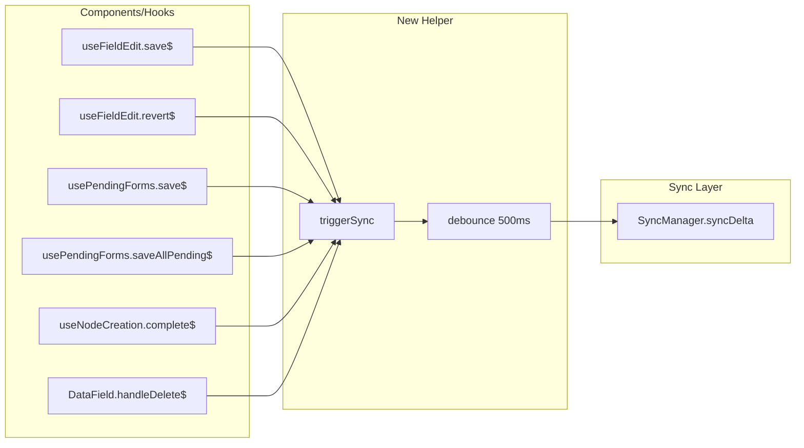

# Debounced Sync Trigger Integration

## Overview

Add a centralized, debounced `triggerSync()` helper that components and hooks call after CUD operations. This keeps services pure while ensuring all user-initiated data changes trigger sync.

## Architecture



## Implementation

### Step 1: Create the Sync Trigger Helper

Create new file: [src/hooks/useSyncTrigger.ts](src/hooks/useSyncTrigger.ts)

```typescript
/**
 * useSyncTrigger - Debounced sync trigger for CUD operations.
 * 
 * Call triggerSync() after any create, update, delete, or revert operation.
 * The debounce batches rapid edits so we don't spam the server.
 */

import { getSyncManager } from '../data/sync/syncManager';

const DEBOUNCE_MS = 500;

let timeoutId: ReturnType<typeof setTimeout> | null = null;

/**
 * Trigger a debounced delta sync.
 * Safe to call frequently - will only sync 500ms after the last call.
 * Fire-and-forget: errors are logged, not thrown.
 */
export function triggerSync(): void {
  // Clear any pending sync
  if (timeoutId !== null) {
    clearTimeout(timeoutId);
  }
  
  // Schedule new sync after debounce window
  timeoutId = setTimeout(() => {
    timeoutId = null;
    getSyncManager()
      .syncDelta()
      .catch((err) => console.error('[triggerSync] Sync failed:', err));
  }, DEBOUNCE_MS);
}

/**
 * Cancel any pending sync (useful for cleanup/testing).
 */
export function cancelPendingSync(): void {
  if (timeoutId !== null) {
    clearTimeout(timeoutId);
    timeoutId = null;
  }
}
```

### Step 2: Integrate into useFieldEdit

File: [src/hooks/useFieldEdit.ts](src/hooks/useFieldEdit.ts)

Add import at top:

```typescript
import { triggerSync } from './useSyncTrigger';
```

Add `triggerSync()` call after `save$` succeeds (line ~171):

```typescript
const save$ = $(async () => {
    if (appState.editingFieldId !== options.fieldId) return;
    const newVal = editValue.value.trim() === '' ? null : editValue.value;
    await getFieldService().updateFieldValue(options.fieldId, newVal);
    currentValue.value = newVal ?? '';
    stopFieldEdit$();
    triggerSync(); // <-- ADD THIS
    if (options.onUpdated$) {
        await options.onUpdated$();
    }
});
```

Add `triggerSync()` call after `revert$` succeeds (line ~251):

```typescript
const revert$ = $(async (value: string | null) => {
    await getFieldService().updateFieldValue(options.fieldId, value);
    currentValue.value = value ?? '';
    previewValue.value = null;
    triggerSync(); // <-- ADD THIS
    if (options.onUpdated$) {
        await options.onUpdated$();
    }
});
```

### Step 3: Integrate into usePendingForms

File: [src/hooks/usePendingForms.ts](src/hooks/usePendingForms.ts)

Add import at top:

```typescript
import { triggerSync } from './useSyncTrigger';
```

Add `triggerSync()` in `save$` after persisting (line ~157):

```typescript
const save$ = $(async (formId: string, fieldName: string, fieldValue: string | null) => {
    const name = fieldName.trim();
    if (!name) {
        forms.value = forms.value.filter(f => f.id !== formId);
        return;
    }
    const form = forms.value.find(f => f.id === formId);
    const cardOrder = form?.cardOrder;
    
    await getFieldService().addField(options.nodeId, name, fieldValue, cardOrder);
    forms.value = forms.value.filter(f => f.id !== formId);
    triggerSync(); // <-- ADD THIS
    await options.onSaved$();
});
```

Add `triggerSync()` in `saveAllPending$` after all fields are saved (line ~196):

```typescript
const saveAllPending$ = $(async (): Promise<number> => {
    const formsToSave = forms.value.filter(f => f.fieldName.trim());
    if (formsToSave.length === 0) return 0;

    const fieldService = getFieldService();
    await Promise.all(
        formsToSave.map(f => 
            fieldService.addField(options.nodeId, f.fieldName.trim(), f.fieldValue, f.cardOrder)
        )
    );

    forms.value = [];
    triggerSync(); // <-- ADD THIS
    await options.onSaved$();
    
    return formsToSave.length;
});
```

### Step 4: Integrate into useNodeCreation

File: [src/hooks/useNodeCreation.ts](src/hooks/useNodeCreation.ts)

Add import at top:

```typescript
import { triggerSync } from './useSyncTrigger';
```

Add `triggerSync()` in `complete$` after node is updated (line ~119):

```typescript
const complete$ = $(async (payload: CreateNodePayload) => {
    const ucData = appState.underConstruction;
    if (!ucData) return;

    await getNodeService().updateNode(ucData.id, {
        nodeName: payload.nodeName || 'Untitled',
        nodeSubtitle: payload.nodeSubtitle || '',
    });

    if (payload.fields.length > 0) {
        const fieldService = getFieldService();
        await Promise.all(
            payload.fields.map(f => fieldService.addField(ucData.id, f.fieldName, f.fieldValue))
        );
    }

    triggerSync(); // <-- ADD THIS (after all DB operations, before UI transitions)
    await completeConstruction$();
    await options.onCreated$();
});
```

Note: `start$()` intentionally does NOT trigger sync. The empty node is just scaffolding; we sync when the user completes creation.

### Step 5: Integrate into DataField delete handler

File: [src/components/DataField/DataField.tsx](src/components/DataField/DataField.tsx)

Add import at top:

```typescript
import { triggerSync } from '../../hooks/useSyncTrigger';
```

Add `triggerSync()` in `handleDelete$` (line ~65):

```typescript
const handleDelete$ = $(async () => {
    await getFieldService().deleteField(props.id);
    triggerSync(); // <-- ADD THIS
    if (props.onDeleted$) {
        props.onDeleted$();
    }
});
```

## Summary of Changes

| File | Function | Operation |

|------|----------|-----------|

| `useSyncTrigger.ts` | NEW | Debounced sync helper |

| `useSyncTrigger.test.ts` | NEW | Unit tests for debounce behavior |

| `useFieldEdit.ts` | `save$`, `revert$` | Update field value |

| `usePendingForms.ts` | `save$`, `saveAllPending$` | Create field(s) |

| `useNodeCreation.ts` | `complete$` | Create/update node |

| `DataField.tsx` | `handleDelete$` | Delete field |

## Step 6: Add Unit Tests

Create new file: [src/test/useSyncTrigger.test.ts](src/test/useSyncTrigger.test.ts)

```typescript
/**
 * Tests for useSyncTrigger - debounced sync trigger helper.
 */

import { describe, it, expect, vi, beforeEach, afterEach } from 'vitest';
import { triggerSync, cancelPendingSync } from '../hooks/useSyncTrigger';
import * as syncManagerModule from '../data/sync/syncManager';

describe('useSyncTrigger', () => {
  const mockSyncDelta = vi.fn().mockResolvedValue(undefined);

  beforeEach(() => {
    vi.useFakeTimers();
    vi.spyOn(syncManagerModule, 'getSyncManager').mockReturnValue({
      syncDelta: mockSyncDelta,
    } as any);
  });

  afterEach(() => {
    cancelPendingSync();
    vi.useRealTimers();
    vi.restoreAllMocks();
    mockSyncDelta.mockClear();
  });

  it('triggers sync after 500ms debounce delay', async () => {
    triggerSync();
    
    // Should not sync immediately
    expect(mockSyncDelta).not.toHaveBeenCalled();
    
    // Should sync after debounce window
    vi.advanceTimersByTime(500);
    expect(mockSyncDelta).toHaveBeenCalledTimes(1);
  });

  it('debounces multiple rapid calls into one sync', () => {
    triggerSync();
    triggerSync();
    triggerSync();
    
    vi.advanceTimersByTime(500);
    expect(mockSyncDelta).toHaveBeenCalledTimes(1);
  });

  it('resets timer on subsequent calls', () => {
    triggerSync();
    vi.advanceTimersByTime(300); // 300ms elapsed
    
    triggerSync(); // Reset timer
    vi.advanceTimersByTime(300); // 600ms total, but only 300ms since reset
    
    // Should NOT have synced yet (only 300ms since last call)
    expect(mockSyncDelta).not.toHaveBeenCalled();
    
    vi.advanceTimersByTime(200); // 500ms since last call
    expect(mockSyncDelta).toHaveBeenCalledTimes(1);
  });

  it('cancelPendingSync prevents scheduled sync', () => {
    triggerSync();
    vi.advanceTimersByTime(200);
    
    cancelPendingSync();
    vi.advanceTimersByTime(500);
    
    expect(mockSyncDelta).not.toHaveBeenCalled();
  });

  it('logs errors but does not throw', async () => {
    const consoleSpy = vi.spyOn(console, 'error').mockImplementation(() => {});
    mockSyncDelta.mockRejectedValueOnce(new Error('Network error'));
    
    triggerSync();
    vi.advanceTimersByTime(500);
    
    // Wait for the promise rejection to be handled
    await vi.runAllTimersAsync();
    
    expect(consoleSpy).toHaveBeenCalledWith(
      '[triggerSync] Sync failed:',
      expect.any(Error)
    );
    consoleSpy.mockRestore();
  });
});
```

## Testing Considerations

- **Unit tests** (above): Verify debounce timing, batching, cancellation, and error handling
- **Manual test**: Edit a field, check console for `[SyncManager] Starting delta sync cycle...` after 500ms
- **Manual test**: Rapid edits should only trigger one sync (debounce working)