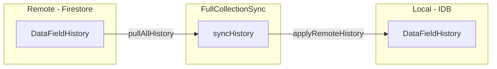

# History Sync

## Overview

Sync DataFieldHistory entries across devices. Currently, history is created locally but never pulled from remote. This plan adds the sync infrastructure without changing deletion behavior.

## Changes Required

### 1. Interface Changes

**[src/data/storage/storageAdapter.ts](src/data/storage/storageAdapter.ts)**

Add to `SyncableStorageAdapter`:

```typescript
// History sync methods
getAllHistory(): Promise<DataFieldHistory[]>;
applyRemoteHistory(history: DataFieldHistory): Promise<void>;
```

Add to `RemoteSyncAdapter`:

```typescript
pullAllHistory(): Promise<DataFieldHistory[]>;
```

### 2. IDBAdapter Implementation

**[src/data/storage/IDBAdapter.ts](src/data/storage/IDBAdapter.ts)**

Add two methods:

```typescript
async getAllHistory(): Promise<DataFieldHistory[]> {
  return await db.history.toArray();
}

async applyRemoteHistory(history: DataFieldHistory): Promise<void> {
  await db.history.put(history);
}
```

### 3. FirestoreAdapter Implementation

**[src/data/storage/firestoreAdapter.ts](src/data/storage/firestoreAdapter.ts)**

Add method:

```typescript
async pullAllHistory(): Promise<DataFieldHistory[]> {
  const snap = await getDocs(collection(db, COLLECTIONS.HISTORY));
  return snap.docs.map(d => d.data() as DataFieldHistory);
}
```

### 4. FullCollectionSync Changes

**[src/data/sync/fullCollectionSync.ts](src/data/sync/fullCollectionSync.ts)**

Update constructor to accept history callback, add `syncHistory()`:

```typescript
export class FullCollectionSync {
  constructor(
    private local: SyncableStorageAdapter,
    private remote: RemoteSyncAdapter,
    private applyRemoteNode: (node: TreeNode) => Promise<void>,
    private applyRemoteField: (field: DataField) => Promise<void>
  ) {}

  async sync(): Promise<void> {
    await this.syncNodes();
    await this.syncFields();
    await this.syncHistory();  // NEW
  }

  private async syncHistory(): Promise<void> {
    const remoteHistory = await this.remote.pullAllHistory();
    
    // Upsert all remote history entries (no deletion detection)
    for (const hist of remoteHistory) {
      await this.local.applyRemoteHistory(hist);
    }
    
    console.log('[FullCollectionSync] Synced', remoteHistory.length, 'history entries');
  }
}
```

Note: History sync uses simple upsert - no deletion detection. Orphaned history entries are intentional (will be handled by soft delete plan).

### 5. Fix DIP Violation in initStorage.ts

**[src/data/storage/initStorage.ts](src/data/storage/initStorage.ts)**

Replace direct Firestore SDK calls with adapter methods:

```typescript
async function migrateFromFirestore(): Promise<void> {
  const firestoreAdapter = new FirestoreAdapter();
  
  const nodes = await firestoreAdapter.pullAllNodes();
  const fields = await firestoreAdapter.pullAllFields();
  const history = await firestoreAdapter.pullAllHistory();
  
  // Bulk insert into IDB
  await db.transaction('rw', db.nodes, db.fields, db.history, db.syncMetadata, async () => {
    if (nodes.length > 0) await db.nodes.bulkPut(nodes);
    if (fields.length > 0) await db.fields.bulkPut(fields);
    if (history.length > 0) await db.history.bulkPut(history);
    await db.syncMetadata.put({ key: 'lastSyncTimestamp', value: Date.now() });
  });
}
```

Remove unused imports: `collection`, `getDocs`, `query`, `orderBy` from firebase/firestore.

## Sync Behavior Summary




- Pull all remote history
- Upsert each entry locally
- No deletion detection (orphans preserved)
- History created on other clients now appears locally

## Testing Notes

- Add test for history sync in `syncManager.test.ts`
- Verify history entries from remote are pulled
- Verify existing local history is preserved (upsert, not replace)

