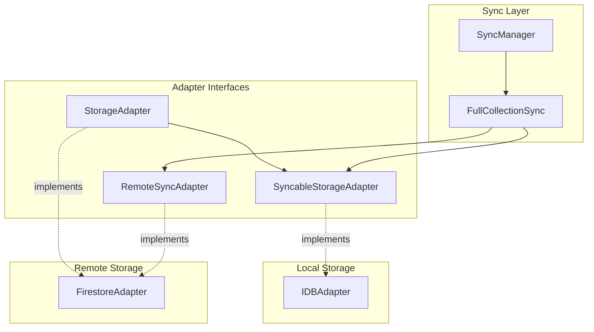

# History Sync Implementation

## Current Problem

- `FullCollectionSync` only syncs nodes and fields (no history)
- History entries created on other clients are never pulled
- When fields are deleted via sync, their history entries remain as orphans
- `initStorage.ts` uses direct Firestore SDK calls instead of adapter (DIP violation)

## Architecture Overview



## Changes Required

### 1. Update Interface Contracts

**[src/data/storage/storageAdapter.ts](src/data/storage/storageAdapter.ts)**

Add to `SyncableStorageAdapter`:

- `getAllHistory(): Promise<DataFieldHistory[]>` - Get all local history entries
- `deleteHistoryForField(dataFieldId: string): Promise<void>` - Cascade delete history when field is deleted

Add to `RemoteSyncAdapter`:

- `pullAllHistory(): Promise<DataFieldHistory[]>` - Pull all history from remote

### 2. Implement in FirestoreAdapter

**[src/data/storage/firestoreAdapter.ts](src/data/storage/firestoreAdapter.ts)**

Add `pullAllHistory()` method (similar to existing `pullAllNodes`/`pullAllFields`):

```typescript
async pullAllHistory(): Promise<DataFieldHistory[]> {
  const snap = await getDocs(collection(db, COLLECTIONS.HISTORY));
  return snap.docs.map(d => d.data() as DataFieldHistory);
}
```

### 3. Implement in IDBAdapter

**[src/data/storage/IDBAdapter.ts](src/data/storage/IDBAdapter.ts)**

Add two methods:

```typescript
async getAllHistory(): Promise<DataFieldHistory[]> {
  return await db.history.toArray();
}

async deleteHistoryForField(dataFieldId: string): Promise<void> {
  await db.history.where('dataFieldId').equals(dataFieldId).delete();
}
```

Update `deleteFieldLocal()` to cascade delete history:

```typescript
async deleteFieldLocal(id: string): Promise<void> {
  await db.transaction('rw', db.fields, db.history, async () => {
    await db.fields.delete(id);
    await db.history.where('dataFieldId').equals(id).delete();
  });
}
```

### 4. Add History Sync to FullCollectionSync

**[src/data/sync/fullCollectionSync.ts](src/data/sync/fullCollectionSync.ts)**

Add `syncHistory()` method called from `sync()`:

```typescript
async sync(): Promise<void> {
  await this.syncNodes();
  await this.syncFields();
  await this.syncHistory();  // NEW
}

private async syncHistory(): Promise<void> {
  const remoteHistory = await this.remote.pullAllHistory();
  const remoteIds = new Set(remoteHistory.map(h => h.id));
  
  const localHistory = await this.local.getAllHistory();
  
  // Delete orphaned local history (field deleted remotely)
  for (const localHist of localHistory) {
    if (!remoteIds.has(localHist.id)) {
      // History entry not in remote - parent field was likely deleted
      await this.local.deleteHistoryLocal(localHist.id);
    }
  }
  
  // Apply remote history (upsert - history is append-only)
  for (const remoteHist of remoteHistory) {
    await this.local.applyRemoteHistory(remoteHist);
  }
}
```

Additional methods needed on `SyncableStorageAdapter`:

- `deleteHistoryLocal(id: string): Promise<void>` - Delete single history entry
- `applyRemoteHistory(history: DataFieldHistory): Promise<void>` - Upsert history entry

### 5. Fix initStorage.ts DIP Violation

**[src/data/storage/initStorage.ts](src/data/storage/initStorage.ts)**

Replace direct Firestore SDK calls in `migrateFromFirestore()` with adapter methods:

```typescript
async function migrateFromFirestore(): Promise<void> {
  const firestoreAdapter = new FirestoreAdapter();
  
  const nodes = await firestoreAdapter.pullAllNodes();
  const fields = await firestoreAdapter.pullAllFields();
  const history = await firestoreAdapter.pullAllHistory();
  
  // Bulk insert into IDB...
}
```

Remove unused imports: `collection`, `getDocs`, `query`, `orderBy` from firebase/firestore.

## Summary of Interface Changes

| Interface | New Methods |

|-----------|-------------|

| `SyncableStorageAdapter` | `getAllHistory()`, `deleteHistoryForField()`, `deleteHistoryLocal()`, `applyRemoteHistory()` |

| `RemoteSyncAdapter` | `pullAllHistory()` |

## Testing Considerations

- Add test for history sync in `syncManager.test.ts`
- Verify cascade deletion works when field is deleted via sync
- Verify orphaned history is cleaned up
- Verify new history entries from remote are pulled