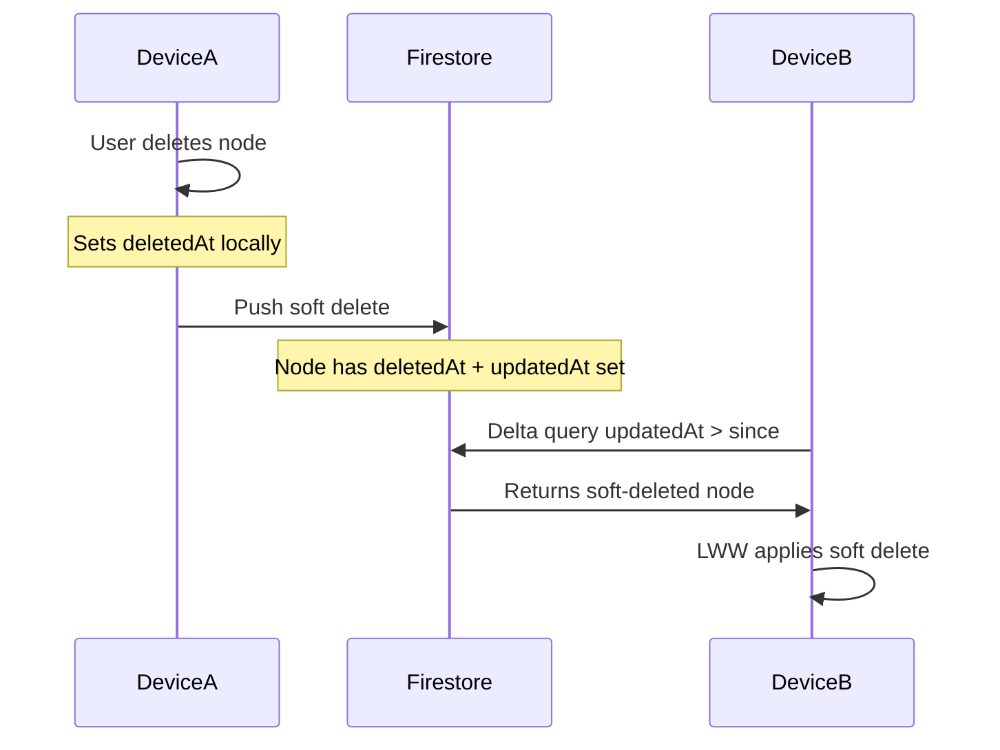
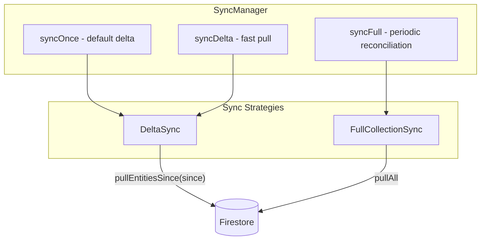
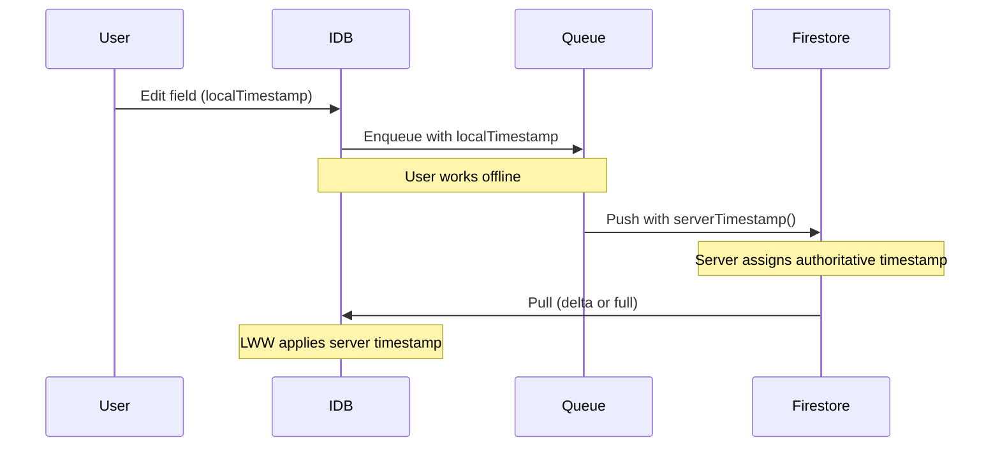

# Hybrid Sync and Server Timestamps

This plan covers three related improvements to the sync architecture:

1. **Fix soft delete consistency** - applySyncItem uses hard delete but IDBAdapter uses soft delete
2. **DeltaSync strategy** - Pull only changes since last sync (fast)
3. **Server timestamps on push** - Authoritative timestamps from Firestore

---

## Part 0: Fix Soft Delete Consistency

### Problem

There is an inconsistency in how deletions are handled:

- **IDBAdapter.deleteNode()** and **deleteField()** use **soft delete** (set `deletedAt` timestamp)
- **FirestoreAdapter.applySyncItem()** uses **hard delete** (`deleteDoc()`) for `delete-node` and `delete-field` operations

This causes issues:

1. Delta sync cannot detect remote deletions (hard-deleted docs don't appear in `updatedAt > since` queries)
2. Inconsistent data model between local and remote

### Solution

Change `applySyncItem()` to use soft delete, matching the IDBAdapter behavior. The soft-deleted entity will:

- Have `deletedAt` set (with `serverTimestamp()`)
- Have `updatedAt` updated (with `serverTimestamp()`)
- Remain in Firestore (queryable, detectable by delta sync)

**[src/data/storage/firestoreAdapter.ts](src/data/storage/firestoreAdapter.ts)** - Change delete operations:

```typescript
// BEFORE (hard delete):
case 'delete-node': {
  await deleteDoc(doc(db, COLLECTIONS.NODES, item.entityId));
  break;
}

// AFTER (soft delete):
case 'delete-node': {
  const ref = doc(db, COLLECTIONS.NODES, item.entityId);
  await updateDoc(ref, {
    deletedAt: serverTimestamp(),
    updatedAt: serverTimestamp(),
  });
  break;
}

case 'delete-field': {
  const ref = doc(db, COLLECTIONS.FIELDS, item.entityId);
  await updateDoc(ref, {
    deletedAt: serverTimestamp(),
    updatedAt: serverTimestamp(),
  });
  break;
}
```

### Why This Enables Delta Sync

With soft deletes consistently applied:



The soft-deleted entity appears in delta queries because `updatedAt` was updated.

---

## Part 1: DeltaSync Strategy

### Current State

- `FullCollectionSync` pulls ALL entities on every sync
- `RemoteSyncAdapter.pullEntitiesSince()` already exists but is unused
- `lastSyncTimestamp` is tracked in IDB but only used for metadata

### Architecture



### New Files

**[src/data/sync/strategies/DeltaSync.ts](src/data/sync/strategies/DeltaSync.ts)** - New file

```typescript
export class DeltaSync implements SyncStrategy {
  readonly name = 'delta';
  
  constructor(
    private local: SyncableStorageAdapter,
    private remote: RemoteSyncAdapter,
    private resolver: LWWResolver
  ) {}
  
  async sync(): Promise<SyncResult> {
    const since = await this.local.getLastSyncTimestamp();
    
    // Pull nodes updated since last sync
    const nodes = await this.remote.pullEntitiesSince('node', since);
    for (const node of nodes) {
      await this.resolver.resolveNode(node as TreeNode);
    }
    
    // Pull fields updated since last sync
    const fields = await this.remote.pullEntitiesSince('field', since);
    for (const field of fields) {
      await this.resolver.resolveField(field as DataField);
    }
    
    // Pull history updated since last sync
    const history = await this.remote.pullHistorySince(since);
    for (const h of history) {
      await this.local.applyRemoteHistory(h);
    }
    
    return { nodesApplied: nodes.length, fieldsApplied: fields.length, historyApplied: history.length };
  }
}
```

Key differences from FullCollectionSync:

- Uses `since` timestamp for incremental query (much faster)
- Detects soft deletes via updated `updatedAt` (requires Part 0 fix)
- Full sync still useful as periodic safety net for edge cases

### Interface Changes

**[src/data/storage/storageAdapter.ts](src/data/storage/storageAdapter.ts)** - Add to `RemoteSyncAdapter`:

```typescript
export interface RemoteSyncAdapter {
  // ... existing methods
  pullHistorySince(since: number): Promise<DataFieldHistory[]>;
}
```

**[src/data/storage/firestoreAdapter.ts](src/data/storage/firestoreAdapter.ts)** - Implement:

```typescript
async pullHistorySince(since: number): Promise<DataFieldHistory[]> {
  const q = query(
    collection(db, COLLECTIONS.HISTORY),
    where('updatedAt', '>', since)
  );
  const snap = await getDocs(q);
  return snap.docs.map(d => d.data() as DataFieldHistory);
}
```

### SyncManager Changes

**[src/data/sync/syncManager.ts](src/data/sync/syncManager.ts)** - Extend API:

```typescript
export class SyncManager {
  private readonly deltaStrategy: SyncStrategy;
  private readonly fullStrategy: SyncStrategy;
  
  constructor(/*...*/) {
    const resolver = new LWWResolver(local);
    this.deltaStrategy = new DeltaSync(local, remote, resolver);
    this.fullStrategy = new FullCollectionSync(local, remote, resolver);
    // ...
  }
  
  // Default sync uses delta for speed
  async syncOnce(): Promise<void> {
    return this.syncDelta();
  }
  
  // Fast delta sync (detects soft deletes via updatedAt)
  async syncDelta(): Promise<void> {
    if (!this.canSync()) return;
    this._isSyncing = true;
    try {
      await this.pusher.push();
      await this.deltaStrategy.sync();
      await this.local.setLastSyncTimestamp(now());
      dispatchStorageChangeEvent();
    } finally {
      this._isSyncing = false;
    }
  }
  
  // Full sync for periodic reconciliation
  async syncFull(): Promise<void> {
    if (!this.canSync()) return;
    this._isSyncing = true;
    try {
      await this.pusher.push();
      await this.fullStrategy.sync();
      await this.local.setLastSyncTimestamp(now());
      dispatchStorageChangeEvent();
    } finally {
      this._isSyncing = false;
    }
  }
}
```

### initStorage Changes

**[src/data/storage/initStorage.ts](src/data/storage/initStorage.ts)** - Use full sync on startup:

```typescript
// Line ~70-76: Change syncOnce() to syncFull() for initial load
if (typeof navigator !== 'undefined' && navigator.onLine) {
  console.log('[Storage] Triggering initial full sync on startup...');
  syncManager.syncFull().catch(err => {  // Changed from syncOnce()
    console.error('[Storage] Initial sync failed:', err);
  });
}
```

---

## Part 2: Server Timestamps on Push

### Current Problem

Both IDBAdapter and FirestoreAdapter use `now()` (client's `Date.now()`), making LWW resolution unreliable across devices with clock skew.

### Solution

Use Firestore's `serverTimestamp()` when pushing to remote. The flow becomes:



Key insight: **Local IDB keeps client timestamp until sync**. After pull, entities get updated with authoritative server timestamps.

### Implementation

**[src/data/storage/firestoreAdapter.ts](src/data/storage/firestoreAdapter.ts)** - Modify `applySyncItem()`:

```typescript
import { serverTimestamp, updateDoc } from "firebase/firestore";

async applySyncItem(item: SyncQueueItem): Promise<void> {
  switch (item.operation) {
    case 'create-node': {
      const node = item.payload as TreeNode;
      await setDoc(doc(db, COLLECTIONS.NODES, node.id), {
        ...node,
        updatedAt: serverTimestamp(),
      });
      break;
    }
    case 'update-node': {
      const node = item.payload as TreeNode;
      await setDoc(doc(db, COLLECTIONS.NODES, node.id), {
        ...node,
        updatedAt: serverTimestamp(),
      }, { merge: true });
      break;
    }
    case 'delete-node': {
      // Soft delete with server timestamp (enables delta sync detection)
      const ref = doc(db, COLLECTIONS.NODES, item.entityId);
      await updateDoc(ref, {
        deletedAt: serverTimestamp(),
        updatedAt: serverTimestamp(),
      });
      break;
    }
    case 'create-field': {
      const field = item.payload as DataField;
      await setDoc(doc(db, COLLECTIONS.FIELDS, field.id), {
        ...field,
        updatedAt: serverTimestamp(),
      });
      break;
    }
    case 'update-field': {
      const field = item.payload as DataField;
      await setDoc(doc(db, COLLECTIONS.FIELDS, field.id), {
        ...field,
        updatedAt: serverTimestamp(),
      }, { merge: true });
      break;
    }
    case 'delete-field': {
      // Soft delete with server timestamp
      const ref = doc(db, COLLECTIONS.FIELDS, item.entityId);
      await updateDoc(ref, {
        deletedAt: serverTimestamp(),
        updatedAt: serverTimestamp(),
      });
      break;
    }
    case 'create-history': {
      const history = item.payload as DataFieldHistory;
      await setDoc(doc(db, COLLECTIONS.HISTORY, history.id), {
        ...history,
        updatedAt: serverTimestamp(),
      });
      break;
    }
  }
}
```

### What This Achieves

- **Literal last-write-wins**: Whoever's push hits Firestore last gets that moment's server timestamp
- **No clock skew issues**: All timestamps from same authoritative source
- **Offline-friendly**: Client timestamps work locally; server timestamps take over on sync
- **Minimal change**: Only `applySyncItem()` changes; pull/LWW logic unchanged

---

## Testing Strategy

### DeltaSync Tests

Create **[src/test/DeltaSync.test.ts](src/test/DeltaSync.test.ts)**:

- Test: pulls only entities newer than `since` timestamp
- Test: applies LWW resolution for each pulled entity  
- Test: handles empty results gracefully
- Test: pulls nodes, fields, and history independently

### Server Timestamp Tests

Add to existing sync tests:

- Verify `serverTimestamp()` is called for create/update operations
- Integration test: push → pull → verify local has server timestamp

---

## Summary of Changes

| File | Change |

|------|--------|

| `src/data/storage/firestoreAdapter.ts` | Fix delete operations to use soft delete, add `serverTimestamp()`, implement `pullHistorySince` |

| `src/data/sync/strategies/DeltaSync.ts` | **New** - Delta sync strategy |

| `src/data/sync/strategies/index.ts` | Export DeltaSync |

| `src/data/storage/storageAdapter.ts` | Add `pullHistorySince` to interface |

| `src/data/sync/syncManager.ts` | Add `syncDelta()`, `syncFull()`, hold both strategies |

| `src/data/storage/initStorage.ts` | Use `syncFull()` on startup |

| `src/test/DeltaSync.test.ts` | **New** - Delta sync tests |

---

## Not Included (Future / LATER.md)

- **Scoped sync** (`syncScope(nodeId)`) - Requires subtree traversal, more complex
- **Sync-on-write trigger** - UI integration for immediate push after edits
- **Visibility change listener** - Pull on tab focus
- **Sync status indicators** - UI showing sync state