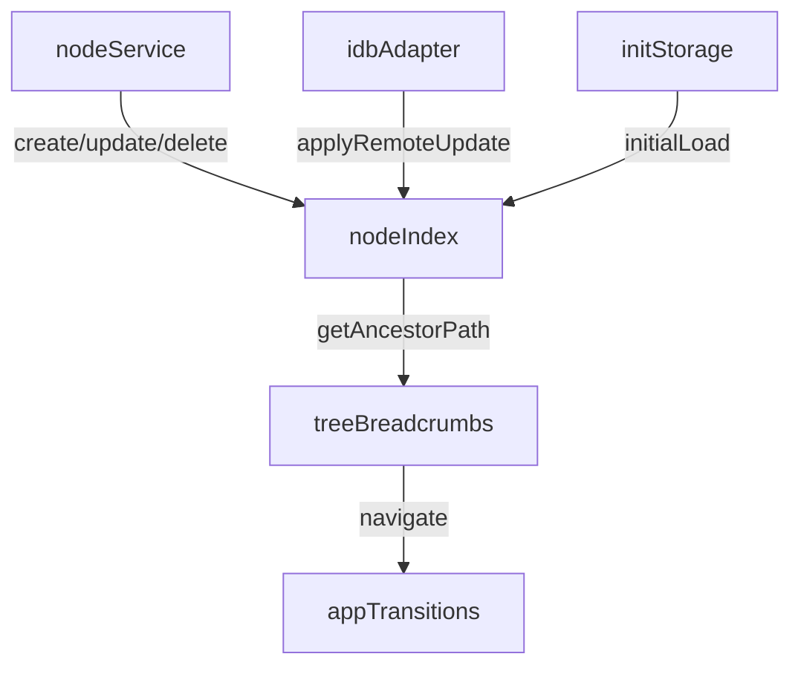

# In-Memory Node Index & Breadcrumbs Plan

## Plan

- **Node index module**: Add `[src/data/nodeIndex.ts](src/data/nodeIndex.ts)` with a Map-backed `{id,parentId,nodeName}` index, `initializeNodeIndex`, `upsertNodeSummary`, `removeNode`, and synchronous `getAncestorPath`. Keep the API minimal—no subscriptions needed because consumers can synchronously recompute paths when they render.
- **Initialization & sync wiring**: In `[src/data/storage/initStorage.ts](src/data/storage/initStorage.ts)` seed the index right after `db.open()` by pulling all active nodes; extend `[src/data/services/index.ts](src/data/services/index.ts)` to touch the index after create/update/delete and to ingest nodes returned from read helpers; update `[src/data/storage/IDBAdapter.ts](src/data/storage/IDBAdapter.ts)` remote paths (`applyRemoteUpdate`, `deleteNodeLocal`, restore helpers) to keep the Map consistent. Ensure updates only touch the affected node entry to honor O(1) requirement, and note that hydration completes (index included) before any TreeNodeDetails renders.
- **Breadcrumb hook & component**: Since the index is fully seeded before any UI renders (hydrate → initStorage → index build), create a light `[src/hooks/useAncestorPath.ts](src/hooks/useAncestorPath.ts)` helper that just calls `getAncestorPath(nodeId)` with no guards. Build `[src/components/Breadcrumbs/TreeBreadcrumbs.tsx](src/components/Breadcrumbs/TreeBreadcrumbs.tsx)` + CSS showing `Ancestor / Parent / **Current**`, wiring ancestor clicks through `useAppTransitions().navigateToNode$`.
- **TreeNodeDetails integration**: Update `[src/components/TreeNodeDetails/TreeNodeDetails.tsx](src/components/TreeNodeDetails/TreeNodeDetails.tsx)` (and its call site in `[src/components/TreeNode/TreeNodeDisplay.tsx](src/components/TreeNode/TreeNodeDisplay.tsx)`) to render the breadcrumb component above existing actions. Keep the render path synchronous and avoid async hooks inside the component body.
- **Rename propagation expectation**: Document that breadcrumb labels update the next time the component re-renders (e.g., after navigation or refresh); we deliberately avoid real-time reactivity for remote edits.
- **Testing & follow-up**: Add focused unit tests for the index in `[src/test/nodeIndex.test.ts](src/test/nodeIndex.test.ts)` covering initialization, path computation, and entry updates. Extend an integration test (e.g. `[src/test/initStorage.test.ts](src/test/initStorage.test.ts)`) to confirm seeding respects deleted nodes, and add a UI-level test to ensure breadcrumb clicks call `navigateToNode$`.

