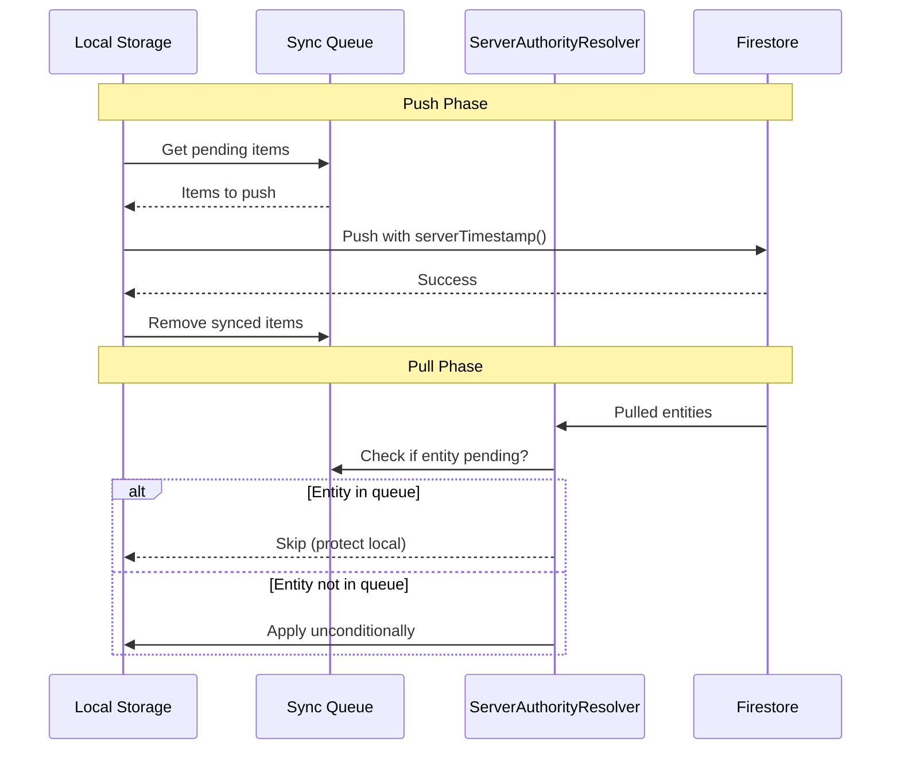

# Server Authority Sync Model

## Problem

Current `LWWResolver` compares `remote.updatedAt > local.updatedAt` to decide whether to apply pulled data. This fails when client clocks are ahead of server time, causing server timestamps to be rejected.

## Solution

Replace timestamp comparison with sync-queue check:

- **Entity NOT in sync queue**: Apply remote unconditionally (server is truth)
- **Entity IN sync queue**: Skip (local change pending push, protect it)

This implements "last to sync wins" - whoever successfully pushed to the server last is the winner.

## Changes

### 1. Refactor LWWResolver to ServerAuthorityResolver

**File**: [src/data/sync/LWWResolver.ts](src/data/sync/LWWResolver.ts)

Rename and refactor to use sync queue check instead of timestamp comparison:

```typescript
export class ServerAuthorityResolver {
  constructor(private local: SyncableStorageAdapter) {}

  async resolveNode(remote: TreeNode): Promise<LWWResult> {
    // Check if this entity has pending local changes
    const isPending = await this.hasPendingSync(remote.id);
    
    if (isPending) {
      // Local change pending push - protect it
      console.log('[Resolver] Skipped (pending local)', remote.id);
      return 'skipped';
    }
    
    // Server is authority - apply unconditionally
    await this.local.applyRemoteUpdate('node', remote);
    console.log('[Resolver] Applied server data', remote.id);
    return 'applied';
  }

  private async hasPendingSync(entityId: string): Promise<boolean> {
    const queue = await this.local.getSyncQueue();
    return queue.some(item => item.entityId === entityId);
  }
}
```

Same pattern for `resolveField()`.

### 2. Update SyncManager and DeltaSync imports

**Files**:

- [src/data/sync/syncManager.ts](src/data/sync/syncManager.ts)
- [src/data/sync/strategies/DeltaSync.ts](src/data/sync/strategies/DeltaSync.ts)
- [src/data/sync/strategies/FullCollectionSync.ts](src/data/sync/strategies/FullCollectionSync.ts)

Update imports from `LWWResolver` to `ServerAuthorityResolver`.

### 3. Update tests

#### A. [src/test/LWWResolver.test.ts](src/test/LWWResolver.test.ts) → Rename to `ServerAuthorityResolver.test.ts`

**Current tests (timestamp-based):**

- "applies remote node when remote is newer" 
- "skips remote node when local is newer"
- "skips remote node on tie"

**New tests (sync-queue-based):**

- "applies remote node when entity NOT in sync queue"
- "applies remote node even when local exists (server is authority)"
- "skips remote node when entity IS in sync queue (pending local changes)"
- "applies remote field when entity NOT in sync queue"
- "skips remote field when entity IS in sync queue"

**Key change**: Mock `getSyncQueue()` instead of comparing timestamps.

```typescript
// OLD: Timestamp comparison
vi.mocked(mockLocal.getNode).mockResolvedValue({ data: localNode });
const result = await resolver.resolveNode(remoteNode); // Compared updatedAt

// NEW: Sync queue check
vi.mocked(mockLocal.getSyncQueue).mockResolvedValue([]); // No pending
const result = await resolver.resolveNode(remoteNode); // Applied unconditionally
```

#### B. [src/test/DeltaSync.test.ts](src/test/DeltaSync.test.ts)

**Changes:**

- Update import: `LWWResolver` → `ServerAuthorityResolver`
- Update type reference in mock: `mockResolver: LWWResolver` → `mockResolver: ServerAuthorityResolver`
- No logic changes needed (already mocks resolver behavior)

#### C. [src/test/FullCollectionSync.test.ts](src/test/FullCollectionSync.test.ts)

**Changes:**

- Update import: `LWWResolver` → `ServerAuthorityResolver`
- Update type reference in mock
- Existing test "does not delete local nodes with pending sync" already validates sync-queue protection

#### D. [src/test/syncManager.test.ts](src/test/syncManager.test.ts)

**Section "LWW Conflict Resolution" needs rewrite:**

| Current Test | New Test |

|--------------|----------|

| "applies remote node when remote is newer" | "applies remote node when NOT in sync queue" |

| "keeps local node when local is newer" | "protects local node when IN sync queue" |

| "queues local node for push when local is newer" | Keep as-is (tests push behavior, not resolution) |

**Critical fix for "keeps local node when local is newer":**

Current test uses `applyRemoteUpdate()` to create local node (bypasses sync queue), then expects it to be protected. This doesn't match real user behavior.

```typescript
// OLD: Uses applyRemoteUpdate (no queue entry) - WRONG for this test
await idbAdapter.applyRemoteUpdate('node', { id, ... });

// NEW: Uses createNode (adds to queue) - simulates real user edit
await idbAdapter.createNode({ id, ... });
// Don't sync yet, so it stays in queue
// Then pull - should skip because pending in queue
```

**Rename section** from "LWW Conflict Resolution" to "Server Authority Resolution".

## Flow Diagram



## Edge Cases Handled

1. **New entity from server**: No local version, no queue entry → applied
2. **Entity we just pushed**: Removed from queue after push → applied (gets server timestamp)
3. **Entity with failed push**: Still in queue → skipped (retry push next cycle)
4. **Entity edited while offline**: In queue → skipped until push succeeds
5. **Concurrent edit by another user**: We pushed first, they pushed second → their version pulled and applied (they won)

## Result

After this change:

- All synced entities will have authoritative server timestamps
- `updatedBy` and `updatedAt` in DataFieldHistory/DataFieldDetails will reflect whoever last synced
- No more clock-skew issues
- Simpler, more predictable sync behavior