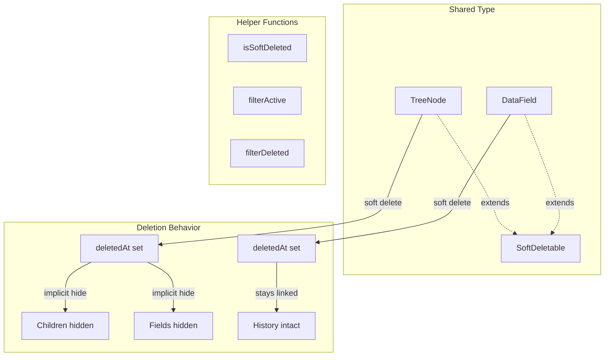

# Soft Delete for All Entities

## Overview

Add soft delete capability to both TreeNode and DataField entities with:

- Shared `SoftDeletable` type and helper functions
- Single Dexie schema migration (version 2)
- Adapter methods updated with filtering
- TreeNode soft delete with implicit child hiding

## Architecture




## Schema Changes

### 1. Shared SoftDeletable Type

**[src/data/models.ts](src/data/models.ts)**

Add shared type and update entity types:

```typescript
// Shared soft delete capability
export type SoftDeletable = {
  deletedAt: number | null;
};

export type TreeNode = {
  id: ID;
  nodeName: string;
  nodeSubtitle?: string;
  parentId: ID | null;
  updatedBy: UserId;
  updatedAt: number;
  deletedAt: number | null;  // NEW
};

export type DataField = {
  id: ID;
  fieldName: string;
  parentNodeId: ID;
  fieldValue: string | null;
  cardOrder: number;
  updatedBy: UserId;
  updatedAt: number;
  deletedAt: number | null;  // NEW
};
```

### 2. Helper Functions

**[src/data/models.ts](src/data/models.ts)** (or new `src/utils/softDelete.ts`)

```typescript
export function isSoftDeleted(entity: SoftDeletable): boolean {
  return entity.deletedAt !== null;
}

export function filterActive<T extends SoftDeletable>(entities: T[]): T[] {
  return entities.filter(e => e.deletedAt === null);
}

export function filterDeleted<T extends SoftDeletable>(entities: T[]): T[] {
  return entities.filter(e => e.deletedAt !== null);
}
```

### 3. Dexie Schema Migration

**[src/data/storage/db.ts](src/data/storage/db.ts)**

Bump to version 2 with `deletedAt` indexes:

```typescript
this.version(2).stores({
  nodes: 'id, parentId, updatedAt, deletedAt',
  fields: 'id, parentNodeId, cardOrder, updatedAt, deletedAt',
  history: 'id, dataFieldId, parentNodeId, updatedAt, rev',
  syncQueue: 'id, status, timestamp, entityType',
  syncMetadata: 'key',
});
```

## Interface Changes

**[src/data/storage/storageAdapter.ts](src/data/storage/storageAdapter.ts)**

Add to `StorageAdapter`:

```typescript
// Soft delete support - Fields
listDeletedFields(parentNodeId: string): Promise<StorageResult<DataField[]>>;
restoreField(id: string): Promise<StorageResult<void>>;

// Soft delete support - Nodes
listDeletedNodes(): Promise<StorageResult<TreeNode[]>>;
listDeletedChildren(parentId: string): Promise<StorageResult<TreeNode[]>>;
restoreNode(id: string): Promise<StorageResult<void>>;
```

Note: Existing `deleteField()` and `deleteNode()` change from hard delete to soft delete.

## Adapter Implementation

### IDBAdapter Changes

**[src/data/storage/IDBAdapter.ts](src/data/storage/IDBAdapter.ts)**

**Node Operations:**

1. `listRootNodes()` - Filter out soft-deleted:
  ```typescript
   const nodes = allNodes.filter(n => n.parentId === null && n.deletedAt === null);
  ```
2. `listChildren()` - Filter out soft-deleted:
  ```typescript
   const children = await db.nodes.where('parentId').equals(parentId).toArray();
   return filterActive(children);
  ```
3. `deleteNode()` - Change to soft delete:
  ```typescript
   async deleteNode(id: string): Promise<StorageResult<void>> {
     const timestamp = now();
     await db.nodes.update(id, { deletedAt: timestamp, updatedAt: timestamp });
     await this.enqueueSyncOperation({ operation: 'update-node', ... });
   }
  ```
4. `listDeletedNodes()` - New method:
  ```typescript
   async listDeletedNodes(): Promise<StorageResult<TreeNode[]>> {
     const nodes = await db.nodes.where('deletedAt').above(0).toArray();
     return createResult(nodes);
   }
  ```
5. `listDeletedChildren()` - New method for deleted children of a node
6. `restoreNode()` - New method:
  ```typescript
   async restoreNode(id: string): Promise<StorageResult<void>> {
     const timestamp = now();
     await db.nodes.update(id, { deletedAt: null, updatedAt: timestamp });
     await this.enqueueSyncOperation({ operation: 'update-node', ... });
   }
  ```
7. `createNode()` - Initialize `deletedAt: null`

**Field Operations:**

1. `listFields()` - Filter out soft-deleted:
  ```typescript
   const fields = await db.fields.where('parentNodeId').equals(parentNodeId).toArray();
   return createResult(filterActive(fields));
  ```
2. `deleteField()` - Change to soft delete:
  ```typescript
   async deleteField(id: string): Promise<StorageResult<void>> {
     const timestamp = now();
     await db.fields.update(id, { deletedAt: timestamp, updatedAt: timestamp });
     // Still create history entry with action: "delete"
     await this.enqueueSyncOperation({ operation: 'update-field', ... });
   }
  ```
3. `listDeletedFields()` - New method:
  ```typescript
   async listDeletedFields(parentNodeId: string): Promise<StorageResult<DataField[]>> {
     const fields = await db.fields.where('parentNodeId').equals(parentNodeId).toArray();
     return createResult(filterDeleted(fields));
   }
  ```
4. `restoreField()` - New method:
  ```typescript
   async restoreField(id: string): Promise<StorageResult<void>> {
     const timestamp = now();
     await db.fields.update(id, { deletedAt: null, updatedAt: timestamp });
     await this.enqueueSyncOperation({ operation: 'update-field', ... });
   }
  ```
5. `createField()` - Initialize `deletedAt: null`

### FirestoreAdapter Changes

**[src/data/storage/firestoreAdapter.ts](src/data/storage/firestoreAdapter.ts)**

Mirror all IDBAdapter changes:

- `listRootNodes()`, `listChildren()` - Add `deletedAt === null` filter
- `deleteNode()` - Change to soft delete
- `listDeletedNodes()`, `listDeletedChildren()` - New methods
- `restoreNode()` - New method
- `listFields()` - Add `deletedAt === null` filter
- `deleteField()` - Change to soft delete
- `listDeletedFields()` - New method
- `restoreField()` - New method
- `createNode()`, `createField()` - Initialize `deletedAt: null`

### FullCollectionSync Consideration

**[src/data/sync/fullCollectionSync.ts](src/data/sync/fullCollectionSync.ts)**

No changes needed. Soft-deleted entities:

- Still have valid IDs (not absent from remote)
- Sync normally via `pullAllNodes()` / `pullAllFields()`
- `deletedAt` is just another property that syncs

## Implicit Hiding Behavior

When a TreeNode is soft-deleted:

- The node itself has `deletedAt` set
- Child nodes are NOT cascade soft-deleted
- Child nodes are implicitly hidden (parent is deleted)
- Fields of the node are implicitly hidden (parent is deleted)
- History stays linked to fields

**Query Logic for UI:**

- Normal views: filter `deletedAt === null` AND check parent chain
- "Deleted Items" view: show nodes/fields where `deletedAt !== null`

For Phase 1, the adapter filtering is sufficient. A "Deleted Items" UI would need to handle the implicit hiding display.

## Testing Notes

- Update existing tests that expect hard delete behavior
- Add tests for soft delete flow (delete -> still exists with deletedAt)
- Add tests for restore flow
- Add tests for filtering (deleted items don't appear in normal queries)
- Add tests for implicit hiding (children of deleted node hidden)

