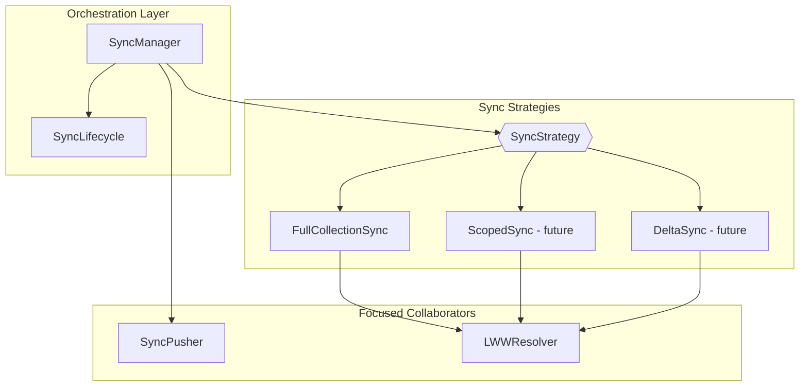

# SyncManager Composition Refactor

## Current State

The `SyncManager` class in [syncManager.ts](src/data/sync/syncManager.ts) handles 5 distinct responsibilities:

1. **Lifecycle** - start/stop, timer, online event listener
2. **Orchestration** - syncOnce, state guards (enabled/offline/syncing)
3. **Push** - queue iteration, remote apply, mark synced/failed
4. **Conflict Resolution** - LWW logic in applyRemoteNode/applyRemoteField
5. **Singleton** - module-level getSyncManager/initializeSyncManager

The `FullCollectionSync` class is already extracted but receives LWW callbacks from SyncManager, coupling them.

## Target Architecture



## New Components

### 1. SyncStrategy Interface

A common contract for all pull sync strategies (full, scoped, delta):

```typescript
// src/data/sync/strategies/SyncStrategy.ts
export interface SyncStrategy {
  readonly name: string;
  sync(): Promise<SyncResult>;
}

export type SyncResult = {
  nodesApplied: number;
  fieldsApplied: number;
  historyApplied: number;
};
```

### 2. LWWResolver

Extracted conflict resolution logic:

```typescript
// src/data/sync/LWWResolver.ts
export class LWWResolver {
  constructor(private local: SyncableStorageAdapter) {}
  
  async resolveNode(remote: TreeNode): Promise<void> { /* LWW logic */ }
  async resolveField(remote: DataField): Promise<void> { /* LWW logic */ }
}
```

### 3. SyncPusher

Extracted push logic:

```typescript
// src/data/sync/SyncPusher.ts
export class SyncPusher {
  constructor(
    private local: SyncableStorageAdapter,
    private remote: RemoteSyncAdapter
  ) {}
  
  async push(): Promise<PushResult> { /* queue processing */ }
}
```

### 4. SyncLifecycle

Timer and event management:

```typescript
// src/data/sync/SyncLifecycle.ts
export class SyncLifecycle {
  constructor(
    private onTick: () => Promise<void>,
    private pollIntervalMs: number
  ) {}
  
  start(): void { /* timer + online listener */ }
  stop(): void { /* cleanup */ }
}
```

### 5. Thin SyncManager

Orchestrates collaborators:

```typescript
// src/data/sync/syncManager.ts (slimmed)
export class SyncManager {
  constructor(
    private pusher: SyncPusher,
    private strategy: SyncStrategy,
    private lifecycle: SyncLifecycle
  ) {}
  
  async syncOnce(): Promise<void> {
    if (!this.canSync()) return;
    await this.pusher.push();
    await this.strategy.sync();
  }
}
```

## File Structure

```
src/data/sync/
  syncManager.ts          # Thin orchestrator + singleton
  SyncPusher.ts           # Push queue processing
  SyncLifecycle.ts        # Timer + online events
  LWWResolver.ts          # Conflict resolution
  strategies/
    SyncStrategy.ts       # Interface
    FullCollectionSync.ts # (moved, updated to use LWWResolver)
    index.ts              # Re-exports
  devTools.ts             # (unchanged)
```

## Migration Steps

1. Create `LWWResolver` - extract applyRemoteNode/applyRemoteField from SyncManager
2. Create `SyncStrategy` interface in new strategies folder
3. Move `FullCollectionSync` to strategies folder, inject LWWResolver instead of callbacks
4. Create `SyncPusher` - extract pushLocalChanges from SyncManager
5. Create `SyncLifecycle` - extract start/stop/handleOnline from SyncManager
6. Slim down `SyncManager` to pure orchestration
7. Update singleton factory to wire collaborators
8. Update tests to test each collaborator in isolation

## Future Extensibility

With `SyncStrategy` interface in place, adding scoped sync or delta sync becomes:

```typescript
// Future: src/data/sync/strategies/ScopedSync.ts
export class ScopedSync implements SyncStrategy {
  readonly name = 'scoped';
  
  constructor(
    private nodeId: string,
    private local: SyncableStorageAdapter,
    private remote: RemoteSyncAdapter,
    private resolver: LWWResolver
  ) {}
  
  async sync(): Promise<SyncResult> {
    // Pull node + descendants only
  }
}
```

The SyncManager can accept different strategies or even compose them.

## Testing Impact

Each collaborator becomes independently testable:

- `LWWResolver` - test conflict scenarios without sync machinery
- `SyncPusher` - test queue processing with mock adapters
- `SyncLifecycle` - test timer/event behavior with fake timers
- `FullCollectionSync` - test pull logic with mock resolver

## Risk Mitigation

- Extract one collaborator at a time, running tests after each
- Keep singleton factory signature unchanged (backwards compatible)
- All existing SyncManager tests should pass after refactor