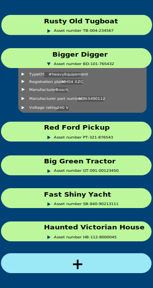

# Asset Tree Management Specification

## Overview
Asset maintenance and management app for physical assets (vehicles, buildings, industrial machinery, etc.) using a recursive tree structure where nodes represent assets and sub-assets. Unlike common tree view UIs where each node only has a name, in this app each node also has a Data Card which has any number of informational fields pertaining to the node. Further, each Data Field itself has an expandable area that holds metadata (such as edit history for the Field) and other features relevent to a Data Field. This structure allows users to construct and understand detailed models of real world assets.

## Core Principles
- **Recursive Tree Structure**: Every node is much the same as any other and can have any number of child nodes.
- **Self Similarity**: Single TreeNode component handles all levels, with state variants for different contexts
- **Self-Construction**: Users create and edit assets, structure, and attributes
- **All-Editable**: Everything is edited, changed, added by Users (except metadata).
- **Modeless In-Situ Editing**: Edit without leaving the tree view or entering edit modes
- **Mobile-First**: Vertical scrolling, single/double-tap interactions
- **Offline-First Data**: Local-first with sync capabilities

## Component Architecture

### Views
- **ROOT View**: Listview of top-level Assets (TreeNodes in root state) + "Create New Asset" button at the bottom. Single flex container element for layout.
- **ASSET View**: Single flex container (column) with gap: 2px containing one parent TreeNode (isParent state) at top, and a children container (flex, column) with 20rem left padding containing all child TreeNodes (isChild state). 

### Core component hierarchy
- **TreeNode**: Main component with NodeTitle, NodeSubtitle, DataCard, CardExpandButton. Should appear as a horizontal row with two nested rows (NodeTitle and NodeSubtitle components), optimized for vertical scrolling lists.
- **NodeTitle**: Displays breadcrumb path "Ancestor1 / Ancestor2 / Parent / **CurrentNode**" (current node in bold). Parsed from ancestorNamePath string.
- **NodeSubtitle**: Simple description or location string
- **DataCard**: Every TreeNode has exactly one DataCard. Contains DataFields (user values) + "Add New Field" button + node metadata section. Slides down into view when expanded. Use a grid container with display: grid and grid-template-rows transition (0fr → 1fr), containing a middle div with overflow: hidden, wrapping a DataCard div with translateY transition (-100% → 0). Both the grid and transform transitions must run simultaneously with matching durations. This should react to content (DataField) quantity without a ref.
- **CardExpandButton**: Simple chevron to expand/collapse DataCard, to the right of NodeSubtitle
- **DataField**: Row item with Label:Value pairs, which users add to an asset node. Most values can be edited afterwards with a simple double-tap interaction. When isEditing=true, the Value is replaced with an input field (Label remains static), and a drag handle appears for reordering. No separate input sub-component needed. 
- **DataFieldMetadata**: Expandable "details" section with Value history, edit history, creation details, etc. and a delete feature for the DataField.
- **ExpandDataField**: Button to expand the DataFieldMetadata section. Simple chevron to the right of each DataField.
- **AddDataField**: Button at the bottom of the DataCard to create a new DataField for the Asset node on its DataCard.
- **"Up" Button**: On the left end of parent nodes (Asset node at top of ASSET view). Navigates up the tree using parentId to find the parent node. If parentId is "ROOT", navigates to home page.
- **CreateNewTreeNode**: Button to create a new TreeNode. Has two states: isRoot: label "Create New Asset" and isChild: label "Create New Sub-Asset Here"

## TreeNode States
- **isRoot**: Top-level nodes on ROOT view. Full width, no children shown, no "Up" button, abbreviated DataCard (first 6 DataFields, or all if fewer than 6). All TreeNodes are in this state at ROOT view.
- **isParent**: Current node being viewed at top of ASSET view. Full width, children shown below, "Up" button, full DataCard. One TreeNode is in this state at top of ASSET view.
- **isChild**: Child nodes under current parent. Narrower (indented) on the left, no children shown, no "Up" button, full DataCard. Any number of first-child TreeNodes appear in this state below the current isParent instance in the ASSET view.
- **isUnderConstruction**: New node requiring setup with in-situ fillable Name and Subtitle fields. Replaces CreateNewTreeNode button in-place as either isRoot or isChild. The isUnderConstruction node's DataCard is set to isCardExpanded and isCardUnderConstruction 

## DataCard States
- **isCardExpanded**: DataCard is open/closed. Persisted to local storage.
- **isCardUnderConstruction**: Default DataField values are active for entry in-situ (though not required). "Save" and "Cancel" buttons at the bottom.

## DataField States
- **isMetadataExpanded**: Metadata / details area is expanded/collapsed. Persisted to local storage.
- **isEditing**: DataField is active for editing (active input field, drag handle to the left). Not persisted - component-local state only.

### State Transitions (use finite state machine pattern)
- isRoot → isParent (navigate to ASSET VIEW)
- isChild → isParent (navigate deeper)
- isParent → isRoot (navigate to home using "Up" button)
- isUnderConstruction → isRoot or isChild (new node created in-situ where button clicked)

## User Experience pathways

### Navigation Logic ... handled client-side without URL changes
- **Down-tree**: Move down the tree by tapping any child node. Takes user to isParent state for that node.
- **Up-tree**: The "Up" button navigates to current node's parent's isParent state, or to ROOT view if no parent.

### Node Creation
- **"Create New Asset" button**: Creates a new TreeNode in isUnderConstruction state, as a child of the current parent "Asset".
- **New TreeNode Construction UI**: In isUnderConstruction state, user must enter "Name" (nodeName) and "Subtitle" (nodeSubtitle) in their respective places on the TreeNode, and fill in the default DataField values in the DataCard. Name is required; empty names are not allowed.
- **New TreeNode DataField Construction UI**: Dropdown menus on the isCardUnderConstruction state of the DataCard for selecting DataFields. Multiple DataFields can be selected for inclusion, see Example DataFields below. The first row is the "Node Metadata" row, with programmatically generated Labels and Values. The next three rows are the defaults, if not filled then not saved. Then five rows of simple drop-down menus for user selection from the full DataField Library. The 10th row has the AddDataField button. The 11th row has the "Save" and "Cancel" buttons. Any fields left empty are not saved.
- **Actions**: "Create"/"Cancel" buttons to finalize or abort the creation of the new TreeNode.

## DataField Management 
- **Double-Tap to edit**: Double-tap on a DataField row (Label or Value) to edit the Value. The Value becomes an active input field. Save by double-tapping again. Cancel by tapping outside. If another DataField is already editing, it is cancelled. (Implementation: Set isEditing=true on double-tap to show input field and drag handle. Set isEditing=false on save/cancel.) Use browser alert for confirmation of save or cancel.
- **Add Data Field**: A "+" button at bottom of DataCard, expands an area with DataFields organized in categories, (similar to isCardUnderConstruction).
- **Delete Data Field**: Expand the DataFieldMetadata to see a "Delete" button at the bottom of the section.
- **Delete TreeNode**: Available in DataCard metadata section. Confirmation required. Deletes node and all children.
- **Reorder on Data Card**: When a Data Field is active for editing, a small "drag handle" appears to the left of the row. The user can drag the row up or down to reorder the DataFields on the DataCard. (Implementation: Show drag handle when isEditing=true. Use HTML5 drag events for interaction. Recalculate and persist cardOrdering numbers to storage.)

### Default DataFields ... Added and active for Value entry at node creation time, but entry not required.
- **"Node Metadata"**: History and metadata for the node: createdBy, createdAt, updatedBy, updatedAt. (generated, non-optional)
- **"Type Of"**: Such as "Vehicle", "Building", "Machine", "Equipment", "Tool", "Other" (arbitrary string entered by user).
- **"Description"**: A short description of the asset.
- **"Tags"**: A list of tags that can be used to search for the asset (arbitrary comma-separated strings entered by user).


### Example DataFields (hardcoded for now)
- Location: 
- Description: 
- Serial Number:
- Part Number:
- Manufacturer:
- Model:
- Weight:
- Dimensions:
- Color:
- Installed Date:
- Status:
- Current Reading:
- Power Rating:
- Note:
- Image: <IMAGE>

### Empty State (ROOT View)
- Default welcome message "Create a new asset to get started"
- CreateNewTreeNode button (isRoot state)


## Data Fetching Strategy:
- **Offline-First Architecture**: All data operations work against local IndexedDB first, with automatic synchronization to cloud/server when connected.
- **Breadth-first data fetching**: Fetch top-level TreeNodeRecords + DataFieldRecords first, then their children, then their children's children, etc.
- **Bidirectional Auto-Sync**: All local changes immediately persist to IndexedDB and queue for cloud/server sync when connected
- **Background Progressive Loading**: Automatically fetch tree layers breadth-first
- **Each chunk**: One TreeNode + its DataFields (DataFields are fetched in parallel)
- **Display Strategy**: Show what's loaded, continue fetching in background
- **Cache Strategy**: IndexedDB + browser cache for offline resilience
- **Conflict Resolution**: Last-write-wins with version tracking for merge conflicts between local and cloud data 

## Data Model

### Conceptual Overview

The system uses a hierarchical tree structure with two primary entities:

1. **TreeNode** - Represents assets and sub-assets in a recursive tree structure
2. **DataField** - Key-value attributes attached to each TreeNode

**Entity Relationships:**
- TreeNode has 0..1 parent TreeNode (self-referential)
- TreeNode has 0..n child TreeNodes
- TreeNode has 0..n DataFields
- DataField belongs to exactly 1 TreeNode

### Entity Schemas

#### TreeNode Entity

**Purpose:** Represents physical assets (vehicles, buildings, machinery) in a hierarchical structure

| Field | Type | Required | Description | Constraints |
|-------|------|----------|-------------|-------------|
| id | string (UUID) | Yes | Unique identifier | Generated client-side |
| nodeName | string | Yes | Display name of the asset | Max 100 chars, required |
| nodeSubtitle | string | No | Additional description/location | Max 200 chars |
| parentId | string \| "ROOT" | Yes | Reference to parent node | Must exist or be "ROOT" |
| ancestorNamePath | string | Yes | Pipe-delimited ancestor names | Auto-generated from ancestors |
| createdBy | string | Yes | User ID of creator | Valid user ID |
| createdAt | timestamp | Yes | Creation time (epoch) | Generated client-side |
| updatedBy | string | Yes | User ID of last editor | Valid user ID |
| updatedAt | timestamp | Yes | Last modification time (epoch) | Auto-updated on changes |
| nodeOrdering | number | No | Display order among siblings | Default: 0 |
| dataFields | Map<string, string> | No | Field ID references | Keys must exist in DataField table |
| childNodes | Map<string, boolean> | No | Child node references | Keys must exist in TreeNode table |

**Phase 2 Fields (Future):**
- virtualParents: string[] - For cross-references (cables, pipes, connections)
- componentType: string - For special node types (settings, templates)
- componentVersion: string - For debugging and compatibility
- customProperties: string[] - For extensibility (API keys, sources)

#### DataField Entity

**Purpose:** Stores configurable attributes and metadata for assets

| Field | Type | Required | Description | Constraints |
|-------|------|----------|-------------|-------------|
| id | string (UUID) | Yes | Unique identifier | Generated client-side |
| fieldName | string | Yes | Display label | Max 50 chars, user-editable |
| parentNodeId | string | Yes | Parent TreeNode reference | Must exist in TreeNode table |
| dataValue | string | Yes | Stored value (any type as string) | Max 1000 chars |
| createdBy | string | Yes | User ID of creator | Valid user ID |
| createdAt | timestamp | Yes | Creation time (epoch) | Generated client-side |
| updatedBy | string | Yes | User ID of last editor | Valid user ID |
| updatedAt | timestamp | Yes | Last modification time (epoch) | Auto-updated on changes |
| cardOrdering | number | Yes | Display position on DataCard | >= 0, unique per parent |
| componentType | string | No | Special rendering type | From allowed list |

**Phase 2 Fields (Future):**
- componentVersion: string - For debugging
- customProperties: string[] - For extensibility
- isRequired: boolean - Validation flag
- isLocked: boolean - Edit protection
- isEditable: boolean - Permission control

### Business Rules

#### TreeNode Rules
1. Root nodes must have parentId = "ROOT"
2. Node names should be meaningful but don't need to be unique
3. ancestorNamePath is automatically maintained by the system
4. Deleting a node must handle or cascade to all children
5. Maximum tree depth is implementation-dependent (suggest 10 levels)

#### DataField Rules
1. Field names should be descriptive (e.g., "Serial Number" not "SN")
2. cardOrdering must be unique within each parent node
3. All values are stored as strings (parsing/validation in UI)
4. Metadata fields (createdAt, updatedAt) auto-update on changes
5. Reordering updates cardOrdering for all affected fields

### DataField Library

These fields are available for selection during node creation on the isCardUnderConstruction state of the DataCard (Phase 1 uses hardcoded list, phase 2 will implement crowd-sourced library):

| Field Name | Category | Type | Example Value | Notes |
|------------|----------|------|---------------|-------|
| Description | General | Text | "Primary cooling pump for HVAC" | Short asset description |
| Type Of | Classification | Text | "Pump", "Vehicle", "Building" | User-defined categories |
| Tags | Search | CSV | "critical, hvac, maintenance" | Comma-separated values |
| Location | Location | Text | "Building A, Room 102" | Physical location |
| Serial Number | Identification | Text | "SN-123456789" | Manufacturer serial |
| Part Number | Identification | Text | "PN-ABC-123" | Manufacturer part number |
| Manufacturer | Identification | Text | "Acme Inc." | Equipment manufacturer |
| Model | Identification | Text | "Model XYZ-500" | Equipment model |
| Status | Status | Enum | "In Service", "Maintenance", "Retired" | Operational status |
| Installed Date | Temporal | Date | "2025-01-01" | Installation date |
| Weight | Physical | Text | "36.2 kg" | Physical weight |
| Dimensions | Physical | Text | "310 x 210 x 110 mm" | Physical dimensions |
| Power Rating | Electrical | Text | "1200W" | Power specifications |
| Current Reading | Measurement | Text | "5.4 amps at 2025-01-01" | Current measurements |
| Note | General | Text | "Requires quarterly maintenance" | General notes |

### Data Examples

#### TreeNode Example
```json
{
  "id": "550e8400-e29b-41d4-a716-446655440001",
  "nodeName": "Main HVAC Unit",
  "nodeSubtitle": "Building A Primary Cooling System",
  "parentId": "ROOT",
  "ancestorNamePath": "",
  "createdBy": "user123",
  "createdAt": 1709856000000,
  "updatedBy": "user456",
  "updatedAt": 1709942400000,
  "nodeOrdering": 0,
  "dataFields": {
    "660e8400-e29b-41d4-a716-446655440004": true,
    "660e8400-e29b-41d4-a716-446655440005": true,
    "660e8400-e29b-41d4-a716-446655440006": true
  },
  "childNodes": {
    "550e8400-e29b-41d4-a716-446655440002": true,
    "550e8400-e29b-41d4-a716-446655440003": true
  }
}
```

#### DataField Examples
```json
[
  {
    "id": "660e8400-e29b-41d4-a716-446655440004",
    "fieldName": "Serial Number",
    "parentNodeId": "550e8400-e29b-41d4-a716-446655440001",
    "dataValue": "HVAC-2024-001",
    "createdBy": "user123",
    "createdAt": 1709856000000,
    "updatedBy": "user123",
    "updatedAt": 1709856000000,
    "cardOrdering": 1,
    "componentType": "text"
  },
  {
    "id": "660e8400-e29b-41d4-a716-446655440005",
    "fieldName": "Status",
    "parentNodeId": "550e8400-e29b-41d4-a716-446655440001",
    "dataValue": "In Service",
    "createdBy": "user123",
    "createdAt": 1709856000000,
    "updatedBy": "user456",
    "updatedAt": 1709942400000,
    "cardOrdering": 2,
    "componentType": "text"
  }
]
```

### Implementation Notes

1. **Storage Strategy:**
   - Primary: IndexedDB for offline-first capability
   - Future: Cloud sync with conflict resolution

2. **ID Generation:**
   - Client-generated UUIDs (v4) for offline creation
   - No dependency on server for ID assignment

3. **Indexing Requirements:**
   - TreeNode: Index on parentId, nodeName
   - DataField: Index on parentNodeId, fieldName


4. **Data Validation:**
   - Enforce at UI component level
   - Validate before IndexedDB writes
   - Server-side validation on sync


## Phase 1 Prototyping Simplifications
- **Skip virtualParents**: Focus on basic parent-child relationships only
- **Skip componentType and componentVersion**: Use hardcoded list of available DataFields 
- **Skip customProperties**: Focus on basic node and DataField types only
- **Skip isRequired**: No "required data field" features for now
- **Skip isEditable and isLocked**: All data fields are editable for now, no "locking" features for now

## Styling Design

