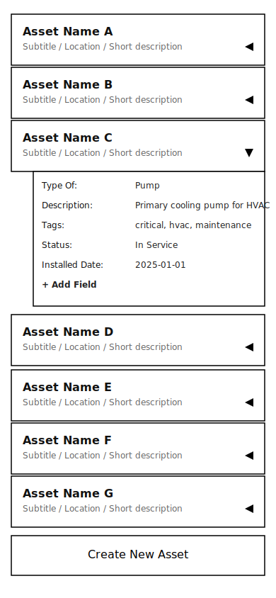

# Asset Tree Management Specification

## Overview
Asset maintenance and management app for physical assets (vehicles, buildings, industrial machinery, etc.) using a recursive tree structure where nodes represent things and their parts. 

Unlike common tree view UIs where each node only has a name, this app has four levels of knowledge structure: 
- Level I: Nodes represent things and their constituent parts. These feature a Title and a Subtitle.
- Level II: Each Node has one Data Card containing any number of Data Fields (facts about that thing).
- Level III: Each Data Field has a Field Details section containing context (e.g., metadata) and management actions (e.g., delete).
- Level IV: Each Field has a complete user‑accessible history of previous Field values.

This structure enables users to construct and understand detailed hierarchical models of real world assets.

## Problem Domain and Solution Domain
The problem domain contains things like Assets, sub-assets, parts, sub-assemblies, power, energy, weight, size, age, risk, drawings, facts, Addresses, People, etc. The solution is a "Tree View" or "Tree Browser" wherein Users can easily create a meaningful, accessible, clear structure from their domain of things, and make changes and updates to data about those things.

## Core Principles
- **Recursive Tree Structure**: Every node is much the same as any other and can have any number of child nodes.
- **Self Similarity**: Single TreeNode component handles all levels
- **Self-Construction**: Users are fully enabled to create and edit assets, structure, and attributes.
- **All-Editable**: Everything is edited, changed, added by Users (except metadata).
- **Modeless In-Situ Editing**: Edit without leaving the tree view or entering edit modes
- **Mobile-First**: Vertical scrolling, single/double-tap interactions
- **Offline-First**: Full UI and any data created locally or already loaded is available indefinitely pending cloud sync. No difference in UX online or offline. Seamless automatic background sync, update, and reconcile.

## Component Architecture

### Views
- **ROOT View**: Listview of top-level TreeNodes (each in isRoot state) + "Create New Asset" button at the bottom. Single grid container element for layout. Each ROOT node is a Tree, creating a root asset creates a new Tree.
- **ASSET View**: Listview comprising a single grid container (rows) with gap: 2px containing one parent TreeNode (isParent state) at top, and a children container (grid) with a left gutter column (width `--child-indent`). ASSET View is always scoped to one `treeID` (the current root’s id).


### Core component hierarchy
- **TreeNode**: Main component with NodeTitle, NodeSubtitle, DataCard, CardExpandButton. Should appear as a horizontal row with two nested rows (NodeTitle and NodeSubtitle components), optimized for vertical scrolling lists.
- **NodeTitle**: Displays the current node's `nodeName` (bold).
- **NodeSubtitle**: Simple description or location string
- **DataCard**: Every TreeNode has exactly one DataCard. Contains DataFields (user values) + "Add New Field" button + node metadata section. Slides down into view when expanded. Use a grid container with display: grid and grid-template-rows transition (0fr → 1fr), containing a middle div with overflow: hidden, wrapping a DataCard div with translateY transition (-100% → 0). Both the grid and transform transitions must run simultaneously with matching durations. This should react to content (DataField) quantity without a ref. This expands/retracts using a simple chevron button, located on the body of the parent TreeNode to the right of NodeSubtitle.
- **DataField**: Row item with Label:Value pairs, which users add to an asset node. Most values can be edited afterwards with a simple double-tap interaction. When isEditing=true, the Value is replaced with an input field (Label remains static). No separate input sub-component needed. 
- **DataFieldDetails**: Expandable section (simple chevron) with Field Value history, edit history, creation details, etc., and a delete feature for the Data Field.
- **CreateDataFieldButton**: Button at the bottom of the DataCard to create a new Data Field for the Asset node on its DataCard.
- **"Up" Button**: On the left end of isParent nodes (node at top of ASSET view). Navigates up the tree using parentId to find the parent node. If parentId is "ROOT", navigates to ROOT view.
- **CreateNodeButton**: Create new TreeNodes. One component with contextual variants for ROOT and ASSET views.
- **NodeTools**: Expandable section (simple chevron and label "Tools") containing tools, actions, and settings pertaining to the whole TreeNode. DELETE button only during phase 1.
- **Snackbar**: Global transient notification at bottom. Shows message + optional "Undo". Auto-dismiss after 5s. Queues messages; newest replaces current with reset timer. Used for DataField saves, DataField deletes, and Node cascade deletes (with Undo where applicable).


## TreeNode States
- **isRoot**: Top-level nodes on ROOT view. Full width, no children shown, no "Up" button, abbreviated DataCard (first 6 DataFields by `cardOrdering`, or all if fewer than 6). All TreeNodes are in this state at ROOT view.
- **isParent**: Current node being viewed at top of ASSET view. Full width, children shown below, "Up" button, full DataCard. One TreeNode is in this state at top of ASSET view.
- **isChild**: Child nodes under current parent. Narrower (indented) on the left, no children shown, full DataCard. Any number of first-child TreeNodes appear in this state below the current isParent instance in the ASSET view.
- **isUnderConstruction**: New node requiring setup with in-situ fillable Name and Subtitle fields. Replaces CreateNodeButton button in-place as either isRoot or isChild. The isUnderConstruction node's DataCard state is also set to isUnderConstruction.

## DataCard States
- **isExpanded**: DataCard is open/closed. Persisted to local storage.
- **isUnderConstruction**: Default Data Field values are active for entry in-situ (though not required). NodeTools not shown. CreateDataFieldButton in last row and functions as normal. "Save" and "Cancel" buttons at the bottom.

## DataField States
- **isMetadataExpanded**: Field Details area is expanded/collapsed. Persisted to local storage.
- **isEditing**: Data Field is active for editing (active input field). Not persisted - component-local state only.

## CreateNodeButton Contextual Variants
- **root** (ROOT view): Large button styled like a ROOT node at the bottom of ROOT view. Aria-label/title: "Create New Asset". Creates a new Tree (sets `treeID = id`) and navigates to the new node’s ASSET (BRANCH) view.
- **child** (ASSET/BRANCH view): Small inline buttons rendered as their own grid rows, aligned with the left gutter in the two‑column children grid. Multiple instances are shown: for n child nodes, render n+1 buttons (between, above, below child nodes). Aria-label/title: "Create New Sub‑Asset Here". Clicking creates a child `TreeNode` (inherits `treeID = parent.treeID`) and inserts it according to button DOM order. Normal document flow; no absolute positioning. DOM order determines visual position among sibling `TreeNode`s.
- **State on Create** New node appears in `isUnderConstruction` state with in‑situ Name and Subtitle fields.

### State Transitions (use finite state machine pattern)
- isRoot → isParent (navigate to ASSET VIEW)
- isChild → isParent (navigate deeper)
- isParent → isRoot (navigate to home using "Up" button)
- isUnderConstruction → isRoot or isChild (new node created in-situ where button clicked)

## User Experience pathways

### Navigation Logic ... handled client-side without URL changes
- **Down-tree**: Move down the tree by tapping any child node. Takes user to isParent state for that node.
- **Up-tree**: The "Up" button navigates to current node's parent's isParent state, or to ROOT view if no parent.

### Node Creation
- **Create Node**: CreateNodeButton Creates a new TreeNode in isUnderConstruction state, as a child of the current parent (including ROOT). On the ASSET view, multiple child variant instances appear between the isChild instances of TreeNode. The new TreeNode's `nodeOrdering` is determined from DOM order of the CreateNodeButton tapped and persisted; siblings display sorted by `nodeOrdering`.
- **Node Construction UI/UX**: In isUnderConstruction state, user must enter "Name" (nodeName) and "Subtitle" (nodeSubtitle) in their respective places on the TreeNode. Name is required; empty names are not allowed.
- **Add DataFields at Node creation**: In isUnderConstruction state, the `DataCard.isUnderConstruction` contains the default DataFields, with DataFieldValue ready for user entry. If any DataFieldValue remains empty, the whole field is removed at creation.
- **Actions**: "Create"/"Cancel" buttons to finalize or abort the creation of the new TreeNode.
- **Unique Trees**: Creating node on ROOT view sets `treeID = id`. Creating a node on ASSET view (a child node) sets `treeID = parent.treeID`.

### Node Deletion
- **Delete Tree Node**: Button Available in NodeTools section of DataCard. Confirmation required.
- Deleting any `TreeNode` performs a hard cascade: remove the node, all descendant nodes, their `DataField`s, and their `DataFieldHistory`.
- During cascade, no new `DataFieldHistory` entries are written; manual per‑field deletes do write a `delete` history entry (see DataField Management).
- After confirming, show a Snackbar with 5s Undo. If Undo is taken, restore removed records from a temporary in-memory snapshot; otherwise finalize the delete.
- Root (tree) deletion cascades identically.
- UI: one confirm dialog summarizing counts (nodes, fields) before proceeding; Snackbar with Undo follows. After undo window lapses, action is irreversible.

## DataField Management 
- **Double-Tap to edit**: Double-tap on a DataField row (Label or Value) to edit the Value. The Value becomes an active input field. Save by double-tapping again. Cancel by tapping outside. If another DataField is already editing, it is cancelled. (Implementation: Set isEditing=true on double-tap to show input field. Set isEditing=false on save/cancel.) Confirmation is shown via Snackbar with a 5s Undo.
- **Create Data Field**: A "+" button at bottom of DataCard, expands a dropdown menu to choose one from the DataField library. New fields get `cardOrdering = max+1` for the parent.
- **Delete Data Field**: Expand the DataFieldDetails to see a "Delete" button at the bottom of the section. Deletion triggers a Snackbar with 5s Undo before finalizing.
  - Manual DataField delete writes a `DataFieldHistory` entry with `action: "delete"`, `property: "fieldValue"`, and `newValue: null` if Undo is not taken.

### DataField Library - (EXAMPLE hardcoded library for bootstrapping)
Data Fields are selected from a library. The string value of "fieldName" is used as the user-facing Field Name. These Data Fields are available for selection during node creation on the isCardUnderConstruction state of the DataCard.

| Field Name | Category | Type | Example Value | Notes |
|------------|----------|------|---------------|-------|
| Description | General | Text | "Primary cooling pump for HVAC" | Short asset description |
| Type Of | Classification | Text | "Pump", "Vehicle", "Building" | User-defined categories |
| Tags | Search | CSV | "critical, hvac, maintenance" | Comma-separated values |
| Location | Location | Text | "Building A, Room 102" | Physical location |
| Serial Number | Identification | Text | "SN-123456789" | Manufacturer serial |
| Part Number | Identification | Text | "PN-ABC-123" | Manufacturer part number |
| Manufacturer | Identification | Text | "Acme Inc." | Equipment manufacturer |
| Model | Identification | Text | "Model XYZ-500" | Equipment model |
| Status | Status | Enum | "In Service", "Maintenance", "Retired" | Operational status |
| Installed Date | Temporal | Date | "2025-01-01" | Installation date |
| Weight | Physical | Text | "36.2 kg" | Physical weight |
| Dimensions | Physical | Text | "310 x 210 x 110 mm" | Physical dimensions |
| Power Rating | Electrical | Text | "1200W" | Power specifications |
| Current Reading | Measurement | Text | "5.4 amps at 2025-01-01" | Current measurements |
| Note | General | Text | "Requires quarterly maintenance" | General notes |


### Default DataFields ... Added at node creation time.
- **"Node Metadata"**: History and metadata for the node: updatedBy, updatedAt. Timestamps are client-assigned.
- **"Type Of"**: Such as "Vehicle", "Building", "Machine", "Equipment", "Tool", "Other" (arbitrary string entered by user, no entry required).
- **"Description"**: A short description of the asset. (No entry required)
- **"Tags"**: A list of tags that can be used to search for the asset (arbitrary comma-separated strings entered by user. No entry required).

### Empty State (ROOT View)
- Default welcome message "Create a new asset to get started"
- CreateNodeButton shown (isRoot state) 

## Data Model

### Conceptual Overview

The system uses a hierarchical tree structure with two primary entities:

1. **TreeNode** - Represents assets and sub-assets in a recursive tree structure
2. **DataField** - Key-value attributes attached to each TreeNode

**Entity Relationships:**
- TreeNode has 0..1 parent TreeNode (self-referential)
- TreeNode has 0..n child TreeNodes
- TreeNode has 0..n DataFields
- DataField belongs to exactly 1 TreeNode

### Entity Schemas

#### TreeNode Entity

**Purpose:** Represents physical assets (vehicles, buildings, machinery) in a hierarchical structure

| Field | Type | Required | Description | Constraints |
|-------|------|----------|-------------|-------------|
| id | string (UUID) | Yes | Unique identifier | Generated client-side and used as canonical ID |
| nodeName | string | Yes | Display name of the asset | Max 100 chars, required |
| nodeSubtitle | string | No | Additional description/location | Max 200 chars |
| parentId | string \| "ROOT" | Yes | Reference to parent node | Must exist or be "ROOT" |
| updatedBy | string | Yes | User ID of last editor | Valid user ID |
| updatedAt | timestamp | Yes | Last modification time (epoch) | Client-assigned in Phase 1; server-assigned in later phases |
| nodeOrdering | number | No | Display order among siblings | Default: 0, unique per parent |
| dataFields | Map<string, boolean> | No | Presence set of Field ID references | Keys must exist in DataField table |
| childNodes | Map<string, boolean> | No | Child node references | Keys must exist in TreeNode table |
| treeID | string | Yes | Tree boundary identifier | Root: equals `id`. Children: inherited root |
| treeType | string | Yes | Tree classification identifier | Phase 1 fixed: "AssetTree" |

#### DataField Entity

**Purpose:** Stores configurable attributes and metadata for assets

| Field | Type | Required | Description | Constraints |
|-------|------|----------|-------------|-------------|
| id | string (UUID) | Yes | Unique identifier | Generated client-side and used as canonical ID |
| fieldName | string | Yes | Display label | Max 50 chars, user-editable |
| parentNodeId | string | Yes | Parent TreeNode reference | Must exist in TreeNode table |
| fieldValue | string | Yes | Stored value (any type as string) | Max 1000 chars |
| updatedBy | string | Yes | User ID of last editor | Valid user ID |
| updatedAt | timestamp | Yes | Last modification time (epoch) | Client-assigned in Phase 1; server-assigned in later phases |
| cardOrdering | number | Yes | Display position on DataCard | >= 0, unique per parent |
| componentType | string | No | Special rendering type | (Phase 2) From allowed list |
| treeID | string | Yes      | Tree boundary identifier      | Inherited root |
| treeType | string | Yes | Tree classification identifier | Phase 1 fixed: "AssetTree" |

**Phase 2 Fields (Future):**
- componentVersion: string - For debugging
- customProperties: string[] - For extensibility
- isRequired: boolean - Validation flag
- isLocked: boolean - Edit protection
- isEditable: boolean - Permission control

#### DataFieldHistory Entity (Phase 1 minimal)

**Purpose:** Immutable append-only audit log of changes to a single `DataField`'s properties (Phase 1: value changes only)

| Field | Type | Required | Description | Constraints |
|-------|------|----------|-------------|-------------|
| id | string | Yes | Primary key | Composite key `${dataFieldId}:${rev}` |
| dataFieldId | string (UUID) | Yes | Reference to `DataField.id` | Must exist in `DataField` table |
| parentNodeId | string (UUID) | Yes | Reference to owning `TreeNode` | Denormalized for easy queries |
| action | enum | Yes | "create" \| "update" \| "delete" | |
| property | string | Yes | Changed property | Phase 1 fixed: "fieldValue" |
| prevValue | string \| null | Yes | Previous value | null on create |
| newValue | string \| null | Yes | New value | null on delete |
| Notes |  |  | For cascade deletes, no new history entries are appended | |
| updatedBy | string | Yes | Editor identifier | Phase 1: constant (e.g., "localUser") |
| updatedAt | timestamp | Yes | When the change occurred (epoch) | Client-assigned in Phase 1 |
| rev | number | Yes | Monotonic revision per `dataFieldId` | Starts at 0 for create |
| treeID | string | Yes      | Tree boundary identifier      | Inherited root |
| treeType | string | Yes | Tree classification identifier | Phase 1 fixed: "AssetTree" |

Indexes:
- treeNodes: by treeID, by parentId, by nodeOrdering, by updatedAt
- dataFields: by treeID, by parentNodeId, by cardOrdering
- dataFieldHistory: by treeID, by dataFieldId, by updatedAt

### Business Rules

#### TreeNode Rules
1. Root nodes must have parentId = "ROOT"
2. Node names don't need to be unique

#### DataField Rules
1. Field names should be descriptive (e.g., "Serial Number" not "SN")
2. cardOrdering must be unique within each parent node
3. All values are stored as strings (parsing/validation in UI)
4. Metadata field `updatedAt` auto-updates on changes (client-assigned in Phase 1)

## Data Persistence
- Stores: `treeNodes`, `dataFields`, `dataFieldHistory`
- Keys: `treeview:treeNodes`, `treeview:dataFields`, `treeview:dataFieldHistory`
- **Partitioning**: All records include `treeID` and `treeType` (Phase 1: `treeType` = "AssetTree"). 
- **Creation**:
  - Root node: `treeID = id`.
  - Child nodes/fields/history: `treeID = parent’s treeID`.
- Single-user environment; use a constant `updatedBy` "localUser". Only `fieldValue` changes are logged, not `fieldName` changes (phase 1). 

### Data Examples

#### TreeNode Example
```json
{
  "id": "550e8400-e29b-41d4-a716-446655440001",
  "nodeName": "Main HVAC Unit",
  "nodeSubtitle": "Building A Primary Cooling System",
  "parentId": "ROOT",
  "updatedBy": "user456",
  "updatedAt": 1709942400000,
  "nodeOrdering": 0,
  "dataFields": {
    "660e8400-e29b-41d4-a716-446655440004": true,
    "660e8400-e29b-41d4-a716-446655440005": true,
    "660e8400-e29b-41d4-a716-446655440006": true
  },
  "childNodes": {
    "550e8400-e29b-41d4-a716-446655440002": true,
    "550e8400-e29b-41d4-a716-446655440003": true
  }
}
```

#### DataField Examples
```json
[
  {
    "id": "660e8400-e29b-41d4-a716-446655440004",
    "fieldName": "Serial Number",
    "parentNodeId": "550e8400-e29b-41d4-a716-446655440001",
    "fieldValue": "HVAC-2024-001",
    "updatedBy": "user123",
    "updatedAt": 1709856000000,
    "cardOrdering": 1
  },
  {
    "id": "660e8400-e29b-41d4-a716-446655440005",
    "fieldName": "Status",
    "parentNodeId": "550e8400-e29b-41d4-a716-446655440001",
    "fieldValue": "In Service",
    "updatedBy": "user456",
    "updatedAt": 1709942400000,
    "cardOrdering": 2
  }
]
```

#### DataFieldHistory Example (for a single field)
```json
[
  {
    "id": "660e8400-e29b-41d4-a716-446655440004:0",
    "dataFieldId": "660e8400-e29b-41d4-a716-446655440004",
    "parentNodeId": "550e8400-e29b-41d4-a716-446655440001",
    "action": "create",
    "property": "fieldValue",
    "prevValue": null,
    "newValue": "HVAC-2024-001",
    "updatedBy": "localUser",
    "updatedAt": 1709856000000,
    "rev": 0
  },
  {
    "id": "660e8400-e29b-41d4-a716-446655440004:1",
    "dataFieldId": "660e8400-e29b-41d4-a716-446655440004",
    "parentNodeId": "550e8400-e29b-41d4-a716-446655440001",
    "action": "update",
    "property": "fieldValue",
    "prevValue": "HVAC-2024-001",
    "newValue": "HVAC-2025-002",
    "updatedBy": "localUser",
    "updatedAt": 1709942400000,
    "rev": 1
  }
]
```

## Styling Design

<div style="display:flex; gap:25%; align-items:flex-start; background:white; padding:1.5rem; border-radius:1rem;">
  <div>
    <p style="color:black"><strong>ROOT view</strong></p>
    
    
  </div>
  <div>
    <p style="color:black"><strong>ASSET view</strong></p>
    
    
  </div>
</div>

### Style Guide (Phase 1)

- **Principles**: Flat (no shadows), high-contrast text, heavy pill radii, minimal flourish. Use CSS variables so the look can evolve later without refactoring.

- **CSS Tokens** (derived from the mockups):
```css
:root {
  /* Palette */
  --color-bg: #212a40;            /* dark slate (page background) */
  --color-surface: #a3a69c;       /* ash gray surfaces */
  --color-node-main: #a6e07f;     /* light green (primary accent) */
  --color-node-child: #d0f6d1;    /* tea green (child nodes/highlights) */
  --color-accent-warm: #fcb281;   /* sandy brown (icons, cues) */
  --color-text: #212a40;          /* dark slate (text) */


  /* Typography */
  --font-title: "Nirmala UI", system-ui, -apple-system, Segoe UI, Arial, sans-serif;
  --font-body:  "Yu Gothic UI", system-ui, -apple-system, Segoe UI, Arial, sans-serif;
  --font-size-title: 13px;  /* matches mockups */
  --font-size-body:  9px;   /* matches mockups */
  --line-height: 1.35;

  /* Layout & Shape */
  --gap: 2px;              /* global small gap */
  --radius-pill: 9999px;   /* heavy pill */

  /* Tree visuals */
  --child-indent: 1.5rem;         /* indent for children container */
}
```

- **Global**:
```css
html, body {
  background: var(--color-bg);
  color: var(--color-text);
  font-family: var(--font-body);
  font-size: var(--font-size-body);
  line-height: var(--line-height);
}

.TitleText { font-family: var(--font-title); font-size: var(--font-size-title); font-weight: 700; }
.BodyText  { font-family: var(--font-body);  font-size: var(--font-size-body);  }
.Italic    { font-style: italic; }
```

- **Surfaces & Pills**:
```css
.surface {
  background: var(--color-surface);
  border-radius: var(--radius-pill);
  color: var(--color-text);
  box-shadow: none; /* stay flat */
  border: 0;
}

.surface--subtle { background: var(--color-node-child); }
.accent          { background: var(--color-node-main); }
.accent--warm    { background: var(--color-accent-warm); }
```

- **Buttons** (pill):
```css
.btn {
  display: inline-flex;
  align-items: center;
  gap: 0.5rem;
  padding: 0.4rem 0.8rem;
  border-radius: var(--radius-pill);
  border: 0;
  background: var(--color-surface);
  color: var(--color-text);
}

.btn--primary { background: var(--color-node-main); }
.btn--block { width: 100%; justify-content: center; }
```

- **Tree visuals (non-interactive)**:
```css
/* Children container: grid with a left gutter column */
.children {
  position: relative;
  display: grid;
  grid-template-columns: var(--child-indent) 1fr;
  grid-auto-rows: auto;
  row-gap: var(--gap);
}

.children::before { display: none; }

/* Each child row */
.childRow { position: relative; grid-column: 2; }
.childRow::before { display: none; }

/* CreateNodeButton sits in gutter column */
.createNodeButton { grid-column: 1; justify-self: start; text-align: left; }
```

- **Component stubs** (for reference):
```css
.treeNode { display: grid; row-gap: var(--gap); }

.nodeHeader { display: grid; grid-auto-flow: column; align-items: center; column-gap: 0.5rem; }
.nodeTitle  { font-family: var(--font-title); font-size: var(--font-size-title); font-weight: 700; }
.nodeSubtitle { font-family: var(--font-body);  font-size: var(--font-size-body); }

.dataCardShell { display: grid; grid-template-rows: 0fr; transition: grid-template-rows 200ms ease; }
.dataCardShell[data-expanded="true"] { grid-template-rows: 1fr; }
.dataCardOverflow { overflow: hidden; }
.dataCard { transform: translateY(-100%); transition: transform 200ms ease; }
.dataCardShell[data-expanded="true"] .dataCard { transform: translateY(0); }
```

Notes:
- Colors and sizes are intentionally minimal and flat to keep Phase 1 simple; adjust variables to evolve the style later.
